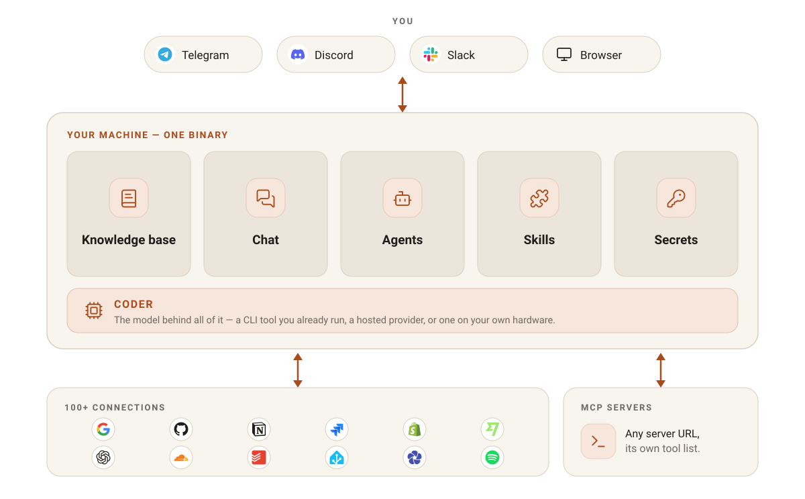

<p align="center">
  
</p>

<p align="center">
  <a href="LICENSE"></a>
  <a href="https://github.com/ilijad1/rookery/releases"></a>
  <a href="https://github.com/ilijad1/rookery/pkgs/container/rookery"></a>
</p>

# Rookery

**Self-hosted AI agents that run on your own machine, around the clock.**

Rookery is a single binary. It keeps your knowledge as plain markdown on your
own disk, builds agents from a conversation rather than a config file, reaches
126 external services with credentials you own, and talks to you on Telegram,
Discord or Slack. The database is SQLite, secrets are encrypted at rest, and
coder subprocesses are confined with Landlock on Linux.

Full documentation lives at **[rookery.cloud/docs](https://rookery.cloud/docs)**.

## Quickstart

```bash
curl -fsSL https://rookery.cloud/install.sh | sh
```

On Windows, in PowerShell:

```powershell
irm https://rookery.cloud/install.ps1 | iex
```

The installer puts a verified binary on your `PATH` and offers the host tools
Rookery degrades without. Then set the install up:

```bash
rookery onboard
```

Open `http://localhost:8080`, log in, and create your first workspace.

> While this repository is private, `curl | sh` returns `404` — release assets
> need an authenticated request. Build from source until the public release.

<details>
<summary>Build from source instead</summary>

Requires Go 1.26 and Node 24.

```bash
make build
./bin/rookery owner bootstrap -u <username> -p <password>
./bin/rookery serve
```
</details>

<details>
<summary>Run the container instead</summary>

```bash
podman run -d --name rookery -p 8080:8080 \
  -v rookery-data:/data ghcr.io/ilijad1/rookery:latest
```

The image is slim: it ships no CLI coder binary and sets
`ROOKERY_CODER_MODE=slim`, so workspaces must use the `api` coder kind.
</details>

## What it's like

<!--
  PLACEHOLDER CONTENT, mirroring src/components/Transcript.tsx in the website
  repository. That file carries the same obligation and states the reason: a
  scripted demo alongside claims that are checkable would be a demo that lies.
  Replace this with a VERBATIM capture from a real designer build before
  launch, redaction being the only permitted edit — and replace BOTH copies
  from the SAME capture, or the two surfaces will show different "real" runs.
-->

> **You** — Every morning, tell me if any of my sites went down overnight.
>
> **Rookery** — Two quick questions. Which sites should I watch, and should I
> message you every morning or only when something is actually wrong?
>
> **You** — rookery.cloud and my blog. Only when something is wrong.
>
> **Rookery** — Here is the agent I will build:
> - Checks both sites every morning at 7am
> - Messages you only if one is unreachable or slow
> - Writes every check into your notes, under Uptime
>
> Type approve and I will build it and test it for real.
>
> **You** — approve

It then writes the agent, runs it against the real services, reports what came
back, and saves only once you have seen that.

## Workspaces

**One machine. Sealed, separate worlds.**

Every workspace is its own tenant — its own knowledge, its own credentials, its
own connected accounts, its own agents. You enter one with its password, and
nothing crosses between them.

[Read more →](https://rookery.cloud/docs/concepts/workspaces)

## Knowledge base

**Everything you know, as plain markdown on your own disk.**

What you write, what your agents learn, and what your connected services bring
in, all in one vault. Open it in Rookery or in any editor you like. Agents read
the whole vault and write durable knowledge back into it across runs.

[Read more →](https://rookery.cloud/docs/concepts/knowledge-base)

## Agents

**Describe it. Don't configure it.**

Say what you want in your own words. Rookery asks a couple of questions,
proposes a plan, builds it, tests it against the real services, and shows you
what happened before anything is saved. Then it just runs.

[Read more →](https://rookery.cloud/docs/concepts/agents)

## Skills

**Things your agents already know how to do.**

22 built in and ready to attach to any agent — reading PDFs and spreadsheets,
web research, browser automation, git, email triage — plus any you create the
same conversational way.

Every agent gets the same tools, whatever model is behind it. A small model on
your own machine and a frontier one are given the same reach. The model
decides how *well* a job is done — never whether it can be done at all.

[Read more →](https://rookery.cloud/docs/concepts/skills)

## Connections

**126 services. No middleman holding your keys.**

Rookery talks to them directly, using credentials you own: 126 providers and 598
curated actions, over OAuth or an API key you paste — never a broker.

Google, GitHub, Notion, Slack, Jira, Stripe, Shopify — and the self-hosted tier
too: Home Assistant, Immich, Paperless-ngx, Nextcloud, Jellyfin.

[Read more →](https://rookery.cloud/docs/concepts/connections)

## MCP servers

**Not on the list? Add it yourself.**

Point Rookery at any Model Context Protocol server by URL — including one running
on your own network — and its tools become available to your agents and to chat.
Nothing about the server ships with Rookery: you supply the URL, it supplies its
own tool list. That is the one thing a curated connection cannot do, because it
does not wait for a release.

You decide which of its tools are switched on, which may run while an agent is
being built, and which need your approval first.

[Read more →](https://rookery.cloud/docs/concepts/mcp-servers)

## Chat

**Ask what you know. Then have it act.**

Talk to your knowledge the way you'd talk to someone who has read all of it —
and have it write a note, or do something in a connected account, right there in
the conversation.

[Read more →](https://rookery.cloud/docs/concepts/chat)

## Notifications

**You find out the moment it happens.**

An agent finished, a service returned something new, a reminder came due. It
lands in your inbox, and reaches you on Telegram, Discord or Slack when you're
away.

[Read more →](https://rookery.cloud/docs/concepts/notifications)

## Models

**Your machine. Your model.**

Use the coder tool you already have, or connect the provider you prefer —
hosted, or running entirely on your own hardware. Nothing ties you to one
vendor.

[Read more →](https://rookery.cloud/docs/concepts/models)

## Secrets

**Credentials that stay yours.**

Encrypted where they sit, unlocked only into the thing that needs them, scoped
to one workspace, and never handed to anyone else.

[Read more →](https://rookery.cloud/docs/concepts/secrets)

## Scheduling

**Every weekday at eight. And again at ten.**

Say when in your own words — twice a day, every Monday at nine, every twenty
minutes during work hours, or only when you ask. Reminders work the same way:
*remind me in 10 minutes to call the doctor.*

[Read more →](https://rookery.cloud/docs/concepts/scheduling)

## How it fits together

<p align="center">
  
</p>

## Configuration

| Variable | Default | Purpose |
|---|---|---|
| `ROOKERY_HOST` | `0.0.0.0` | bind address; `127.0.0.1` for loopback-only |
| `ROOKERY_PORT` | `8080` | listen port |
| `ROOKERY_DATA_DIR` | `~/.rookery` | data root; also relocates the database |
| `ROOKERY_SESSION_KEY` | generated, then pinned to `<data_dir>/session.key` | hex 32-byte session key |
| `ROOKERY_SYSTEM_KEY` | generated | hex key encrypting stored credentials |
| `ROOKERY_PUBLIC_URL` | — | externally reachable base URL for OAuth callbacks |
| `ROOKERY_SANDBOX` | `1` | `0`/`false`/`off` disables Landlock confinement |
| `ROOKERY_CODER_MODE` | `full` | `slim` removes the local CLI coder kind |
| `ROOKERY_CLAUDE_BIN` | `claude` | override the path to a coder binary |

`ROOKERY_PUBLIC_URL` matters more than it looks: OAuth providers reject redirect
URIs on non-public hostnames, so a `.lan` address fails Google's validation. Use
a real hostname — `rookery.cloud` is the documented example — or `http://localhost`.

## Platform support

| Target | Sandbox | Service |
|---|---|---|
| linux amd64/arm64 | Landlock | systemd user unit |
| container (linux) | Landlock | runtime-managed |
| darwin amd64/arm64 | none | launchd (not yet shipped) |
| windows amd64/arm64 | none | SCM (not yet shipped) |

**Off Linux there is no filesystem sandbox**: coder subprocesses run unconfined.
`/healthz` and the startup log both report this.

## Health

`GET /healthz` is unauthenticated and reports version, commit, sandbox status
including the Landlock ABI, coder mode and host-tool presence. A `python3`
warning is not cosmetic — without it the agent-tool AST guardrail self-skips, so
generated tool scripts run unchecked.

## Contributing

Branch off `main`; `main` only ever advances through merged pull requests. Use
[Conventional Commits](https://www.conventionalcommits.org/) — the PR title
becomes the squashed commit and drives release versioning. Run the full gate
locally before opening a PR:

```bash
make ci
```

## License

Apache-2.0. See [LICENSE](LICENSE).
