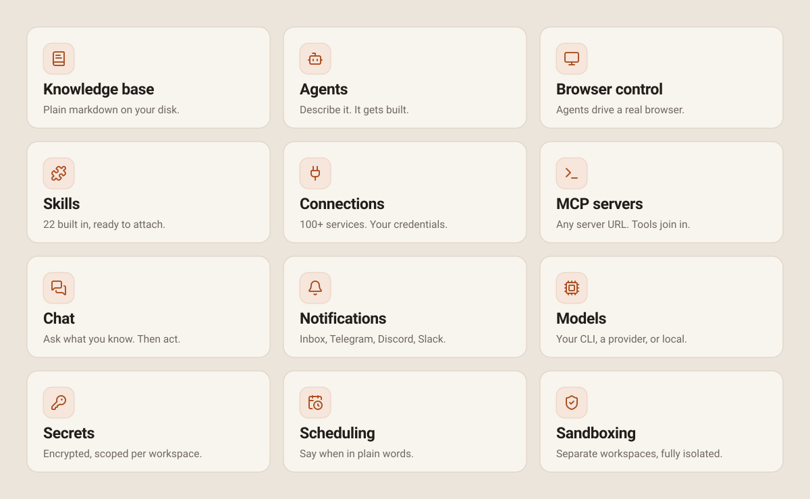

<p align="center">
  <picture>
    <source media="(prefers-color-scheme: dark)" srcset="docs/assets/hero-banner-dark.svg">
    
  </picture>
</p>

<p align="center">
  <a href="LICENSE"></a>
  <a href="https://github.com/rookery-ai/rookery/releases"></a>
  <a href="https://github.com/rookery-ai/rookery/pkgs/container/rookery"></a>
</p>

Everything you know in one markdown knowledge base — what you write, and what
your connected services bring in. Ask it anything, send an agent out for what
isn't there yet, or hand over the whole job and let it run on a schedule you set.

Full documentation lives at **[rookery.cloud/docs](https://rookery.cloud/docs)**.

## Quickstart

```bash
curl -fsSL https://rookery.cloud/install.sh | sh
rookery onboard
```

Then open `http://localhost:8080`, log in, and create your first workspace.

<details>
<summary>Windows</summary>

```powershell
irm https://rookery.cloud/install.ps1 | iex
```
</details>

<details>
<summary>Container</summary>

```bash
docker run -d --name rookery -p 8080:8080 \
  -v rookery-data:/data ghcr.io/rookery-ai/rookery:latest
```

The image is slim — no CLI coder binary, `ROOKERY_CODER_MODE=slim` — so
workspaces must use the `api` coder kind.
</details>

<details>
<summary>Build from source</summary>

Requires Go 1.26 and Node 24.

```bash
make build
./bin/rookery owner bootstrap -u <username> -p <password>
./bin/rookery serve
```
</details>

## What you get

<picture>
  <source media="(prefers-color-scheme: dark)" srcset="docs/assets/features-dark.svg">
  
</picture>

**136 providers** and **934 curated actions**, over OAuth or an API key you
paste — never a broker. **22 skills** built in, plus any you create the same
conversational way.

Read more —
[Workspaces](https://rookery.cloud/docs/concepts/workspaces) ·
[Knowledge base](https://rookery.cloud/docs/concepts/knowledge-base) ·
[Agents](https://rookery.cloud/docs/concepts/agents) ·
[Skills](https://rookery.cloud/docs/concepts/skills) ·
[Connections](https://rookery.cloud/docs/concepts/connections) ·
[MCP servers](https://rookery.cloud/docs/concepts/mcp-servers) ·
[Chat](https://rookery.cloud/docs/concepts/chat) ·
[Notifications](https://rookery.cloud/docs/concepts/notifications) ·
[Models](https://rookery.cloud/docs/concepts/models) ·
[Secrets](https://rookery.cloud/docs/concepts/secrets) ·
[Scheduling](https://rookery.cloud/docs/concepts/scheduling)

## How it fits together

<picture>
  <source media="(prefers-color-scheme: dark)" srcset="docs/assets/architecture-dark.svg">
  
</picture>

## Configuration

| Variable | Default | Purpose |
|---|---|---|
| `ROOKERY_HOST` | `0.0.0.0` | bind address; `127.0.0.1` for loopback-only |
| `ROOKERY_PORT` | `8080` | listen port |
| `ROOKERY_DATA_DIR` | `~/.rookery` | data root; also relocates the database |
| `ROOKERY_SESSION_KEY` | generated, then pinned to `<data_dir>/session.key` | hex 32-byte session key |
| `ROOKERY_SYSTEM_KEY` | generated | hex key encrypting stored credentials |
| `ROOKERY_PUBLIC_URL` | — | externally reachable base URL for OAuth callbacks |
| `ROOKERY_SANDBOX` | `1` | `0`/`false`/`off` disables Landlock confinement |
| `ROOKERY_CODER_MODE` | `full` | `slim` removes the local CLI coder kind |
| `ROOKERY_CLAUDE_BIN` | `claude` | override the path to a coder binary |

`ROOKERY_PUBLIC_URL` matters more than it looks: OAuth providers reject redirect
URIs on non-public hostnames, so a `.lan` address fails Google's validation. Use
a real hostname or `http://localhost`.

## Platform support

| Target | Sandbox | Service |
|---|---|---|
| linux amd64/arm64 | Landlock | systemd user unit |
| container (linux) | Landlock | runtime-managed |
| darwin amd64/arm64 | none | launchd (not yet shipped) |
| windows amd64/arm64 | none | SCM (not yet shipped) |

**Off Linux there is no filesystem sandbox** — coder subprocesses run
unconfined. `GET /healthz` reports that, along with version, coder mode and
host-tool presence; a `python3` warning there is not cosmetic, because without
it the agent-tool AST guardrail self-skips.

## Contributing

Branch off `main`; `main` only ever advances through merged pull requests. Use
[Conventional Commits](https://www.conventionalcommits.org/) — the PR title
becomes the squashed commit and drives release versioning. Run the full gate
locally first with `make ci`.

The three README images are generated —
edit `scripts/gen-readme-assets.py`, never `docs/assets/*.svg`.

## License

Apache-2.0. See [LICENSE](LICENSE).
