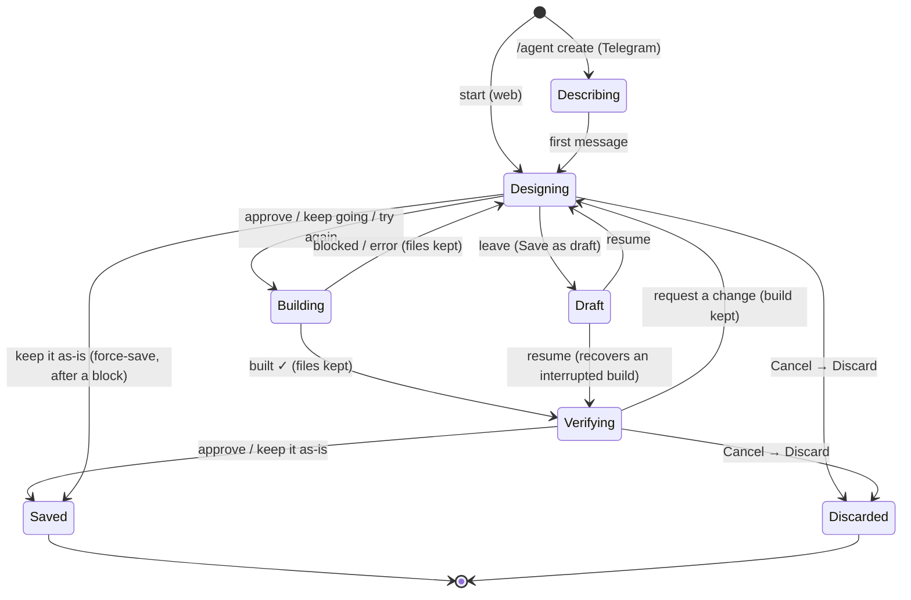

# Agent Designer — State &amp; Flow

How `agentdesigner.Flow` builds an agent, and exactly what happens to your work
when a build **stops**, **blocks**, or you tell it to **continue**.

> The one rule that governs all of it: **your built files are only ever removed by
> an explicit Discard, an agent Delete, or draft expiry (7 days).** Nothing a build
> does to itself deletes them.

An interactive version of this diagram lives at
[`docs/agent-designer-flow.html`](./agent-designer-flow.html).

## The five stages

Every agent moves left to right. Two stages loop back on themselves — that's where
it can feel like you've lost your place. You haven't: you've returned to **Design**
with your built files intact.

| # | Stage | Internal state | Loops? |
|---|-------|----------------|--------|
| 01 | Describe | (entry — name + goal) | — |
| 02 | Design | `StateDesigning` | ↺ the hub |
| 03 | Build | `runGeneration()` | ↺ retry |
| 04 | Review | `StateVerifying` | — |
| 05 | Saved | agent in your KB (`StateDone`) | — |

## State machine

- **Solid forward path** (`Designing → Building → Verifying → Saved`) is the normal
  route.
- **Loops back to `Designing`** are what recover a blocked or changed build without
  losing work.
- Web sessions enter at `Designing`; Telegram enters at `Describing` (its first
  message advances to `Designing`).

## What happens on stop · block · continue

### Block — the build won't finish

The coder ran but the result wasn't presentable: a failed guardrail, a timeout, a
usage limit, or the weak-model gate ("couldn't confirm the script runs").

- Returns to `StateDesigning` — **not** a dead end.
- Files on disk are **kept**; the draft records the failure so the next attempt has
  context (`GenerationFailed = true`).
- Your move: `keep going` (rebuild), `keep it as-is` (save anyway), or describe a
  change. The block message names the options that apply.

### Continue — move it forward

| You say | From | Effect |
|---------|------|--------|
| `approve` / `keep it as-is` | Verifying (or blocked Designing) | Saves: the `draft_<name>` dir is promoted to the real agent, draft cleared. |
| `keep going` / `try again` | blocked Designing | Another build pass, iterating **in the same dir**. |
| _a change request_ | Verifying | Back to Designing, **keeping** the built work; the next build refines it. |

### Stop — step away or cancel

Three very different kinds of "stop" — only one deletes anything.

| Action | Live session | Files | Draft |
|--------|--------------|-------|-------|
| **Navigate away mid-build** | keeps running (detached context) | kept | kept |
| **Cancel → Save as draft** | ends | kept | kept (resumable) |
| **Cancel → Discard** | ends | **removed** | **removed** |
| **Server restart mid-build** | lost | kept | kept (resume recovers to Review) |

## Where your work actually lives

Three places hold your progress; each survives a different interruption.

| # | Layer | Where | Survives | Removed / lost on |
|---|-------|-------|----------|-------------------|
| 1 | Live session | `Flow.sessions` (in-memory) | page navigation | server restart |
| 2 | Built files | `vault/agents/draft_<name>/` | navigation · restart · block | Save · Discard · Delete · 7-day expiry |
| 3 | Draft record | `agent_drafts` (database) | everything short of Discard / expiry | Discard · expiry |

Resume reads layer 3 (the conversation + pending build). If layer 2 holds a valid
built `AGENT.md` that the draft never captured (an interrupted build), resume
**recovers it from disk** and takes you straight to Review.

## Approval matchers (reference)

- `isApproval` (strict, in `StateDesigning`): exact `approve` / `go ahead` /
  `build it` / `create it` / `/approve` → launches a build.
- `isVerifyApproval` (forgiving, in `StateVerifying`): the above plus `yes` / `save`
  / `ok` / `looks good` / `confirm` / `go` / `lgtm` / … → saves; negative cues
  (`don't`, `not yet`, `change`, `wait`, `instead`) route to a change instead.
- `isRetryApproval` (after a block): `isVerifyApproval` plus `try again` / `fix it` /
  `retry` / `keep going` / `keep trying` / `another pass` → rebuilds.
- `isKeepAsIs` (after a block): `keep it as-is` / `save as is` / … → force-saves the
  built files (guardrails still enforced by `SaveAgent`).
